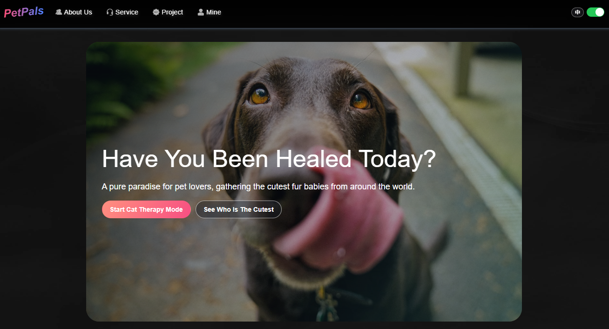

# Share pic with your pets

## Project setup
```
pnpm install
```

### Compiles and hot-reloads for development
```
pnpm dev
```

### Compiles and minifies for production
```
pnpm build
```

### Lints and fixes files
```
pnpm lint
```

### Workspace lint
```
pnpm lint:workspace
```

### Unit tests
```
pnpm test:unit
```

### E2E tests
```
pnpm test:e2e
```

### Preview built app
```
pnpm preview
```

### Documentation
```
docs/README.md
```

Project documents are split into AI engineering context (`docs/ai/`) and Chinese user-facing docs (`docs/human/`).

### Customize configuration
See [Vite Configuration Reference](https://vitejs.dev/config/).
